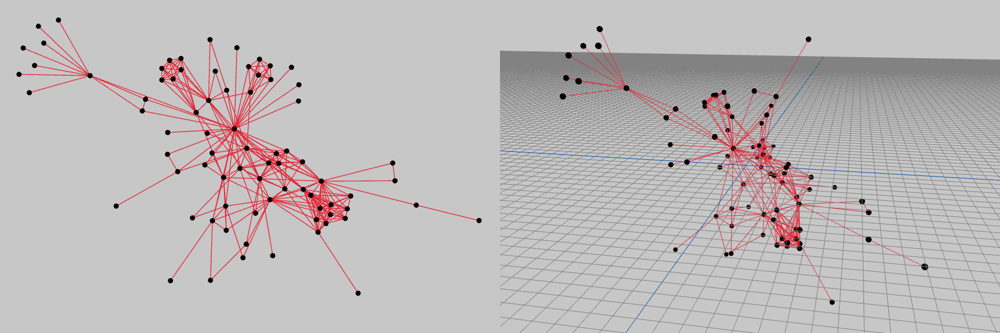

# fdg
A [(force-directed)](https://en.wikipedia.org/wiki/Force-directed_graph_drawing) [graph drawing](https://en.wikipedia.org/wiki/Graph_drawing) library for Rust. *Convert any [`petgraph::Graph`](https://docs.rs/petgraph/latest/petgraph/graph/struct.Graph.html) into a pretty picture!*



The goal of this library is to create some idiomatic building blocks for writing fast graph drawing algorithms in Rust. I hope to implement more algorithms such as [ForceAtlas2 (2014)](https://journals.plos.org/plosone/article?id=10.1371/journal.pone.0098679) and [Kamada-Kawai (1989)](https://citeseerx.ist.psu.edu/document?repid=rep1&type=pdf&doi=b8d3bca50ccc573c5cb99f7d201e8acce6618f04). I also want to experiment with [generating the layouts with SIMD, parallelization, and GPU compute](https://github.com/grantshandy/fdg/issues/15).

The library is currently undergoing a complete rewrite with more performant algorithms and a more generic API (now supports computing in N dimensions 😉). The pre 1.0 version is now located in the `old` branch.

Contributions always welcome!

## Usage
```rust
use fdg::{fruchterman_reingold::FruchtermanReingold, Force, ForceGraph};

// your dataset: Into<StableGraph<(), ()>>

// Initialize a ForceGraph in 2 dimentions with random node positions from -10.0..=10.0.
let mut graph: ForceGraph<f32, 2, (), ()> = fdg::init_force_graph_uniform(dataset, 10.0);

// Apply the Fruchterman-Reingold (1991) force-directed drawing algorithm 100 times.
FruchtermanReingold::default().apply_many(&mut graph, 100);
// Center the graph's average around (0,0).
Center::default().apply(&mut graph);

// Render nodes:
println!("nodes:");
for (_, pos) in graph.node_weights() {
    println!("{pos:?}");
}

// Render edges:
println!("edges:");
for edge_idx in graph.edge_indices() {
    let (source_idx, target_idx) = graph.edge_endpoints(edge_idx).unwrap();

    println!("{edge_idx:?}: {:?} to {:?}", &graph[source_idx].1, &graph[target_idx].1);
}
```
**See [basic.rs](./examples/basic.rs)...**